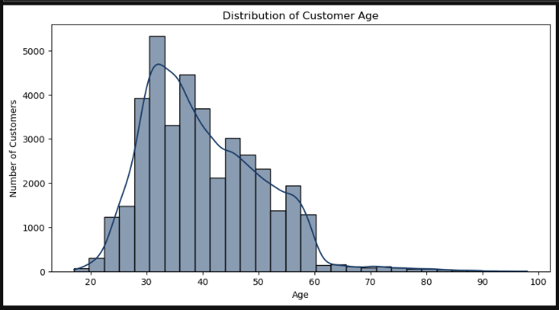
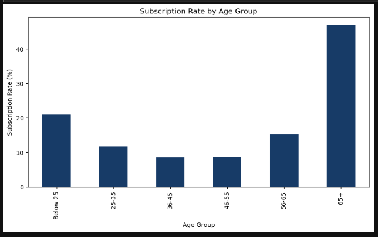
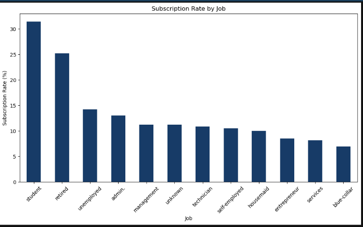
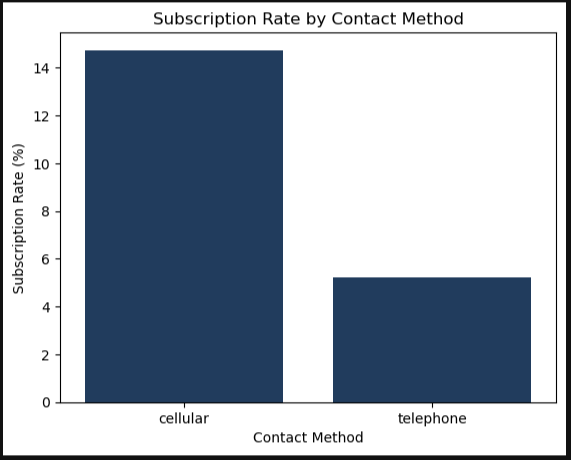
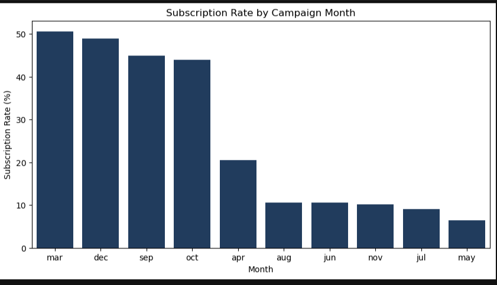
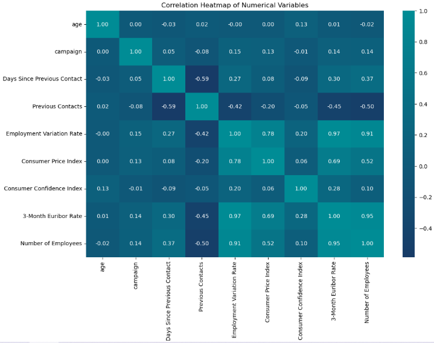

# BANK-DIRECT-MARKETING-CAMPAIGNS
Analysis and Prediction of Bank Direct Marketing Campaign Success
This project analyzes 41,188 bank customer records to identify factors influencing term deposit subscriptions. Using Python, Pandas, NumPy, Matplotlib, Seaborn, and Plotly, the study explores customer profiles, campaign performance, and economic factors to generate insights for improving future marketing campaigns.

## 📌 Project Overview

The banking industry uses direct marketing campaigns to communicate with customers and promote financial products such as term deposits. Understanding customer characteristics, campaign activities, and economic conditions can help banks improve marketing effectiveness.

This project analyzes the **Bank Direct Marketing Campaigns** dataset, containing **41,188 customer records and 20 columns**. The dataset includes customer demographics, financial and loan-related information, campaign contact details, previous campaign outcomes, and economic indicators.

The analysis focuses on understanding customer profiles, evaluating campaign performance, and identifying factors associated with **term deposit subscription outcomes**.

Various analytical techniques were applied, including:

- Data Cleaning and Preprocessing
- Exploratory Data Analysis (EDA)
- GroupBy Analysis
- Pivot Table Analysis
- Correlation Analysis
- Statistical Analysis
- Data Visualization

Python and its data analytics libraries — **Pandas, NumPy, Matplotlib, Seaborn, and Plotly** — were used for data preprocessing, analysis, and visualization.

The main objective of this project is to identify meaningful patterns and relationships in the data and convert them into useful business insights. These insights can support **data-driven decision-making** and help improve the effectiveness of future direct marketing campaigns.

## 📊 Project Details

| Item | Details |
|---|---|
| **Project Title** | Analysis and Prediction of Bank Direct Marketing Campaign Success |
| **Dataset** | Bank Direct Marketing Campaigns |
| **Records** | 41,188 |
| **Columns** | 20 |
| **Target Variable** | Term Deposit Subscription |
| **Project Year** | 2025–2026 |

## 📂 Sample Data Files

The dataset and Jupyter Notebook are included to support reproducibility and allow users to review the analysis process and results.
- `bank-direct-marketing-campaigns.xls` – Project dataset
- `Bank_Direct_Marketing_Analysis.ipynb` – Analysis notebook
- 
## 🛠️ Tools & Technologies

| **Tool / Library** | **Purpose** |
|---|---|
| Python | Data cleaning, analysis, and visualisation |
| Pandas | Data manipulation and analysis |
| NumPy | Numerical operations and data processing |
| Matplotlib | Data visualisation |
| Seaborn | Statistical visualisation |
| Plotly | Interactive visualisation |
| Jupyter Notebook | Analysis, documentation, and presentation |

## 🎯 Project Objective

- Understand customer characteristics and subscription patterns.
- Evaluate the effectiveness of marketing campaigns.
- Identify factors associated with term deposit subscriptions.
- Discover useful customer and campaign patterns.
- Generate insights to support better marketing decisions.
 
  ## 📊 Data Description

The **Bank Direct Marketing Campaigns** dataset contains information about customers contacted during direct marketing campaigns for term deposits.

The dataset contains:

- **41,188 records**
- **20 columns**
- **Target variable:** Term Deposit Subscription

## Main Data Categories

| Category | Examples |
|---|---|
| **Customer Demographics** | Age, Job, Marital Status, Education |
| **Financial Information** | Default, Housing Loan, Personal Loan |
| **Campaign Information** | Contact Method, Month, Day, Campaign Contacts |
| **Previous Campaign** | Previous Contacts, Previous Campaign Result |
| **Economic Indicators** | Employment Variation Rate, Consumer Price Index, Consumer Confidence Index, Euribor Rate, Number of Employees |
| **Target Variable** | Term Deposit Subscription |

The target variable indicates whether the customer subscribed to a **term deposit (`Yes` or `No`)**.

## 🔄 Project Workflow

The project follows a structured data analytics workflow:

Project Overview → Data Description → Project Workflow → Tools & Technologies → EDA → Key Insights → Recommendations → Conclusion

## 🚀 Project Phases

 Phase 1: Data Collection & Understanding
- Load the Bank Direct Marketing Campaigns dataset.
- Understand the dataset structure, variables, and target variable.
- Review data types, summary statistics, and data quality.

 Phase 2: Data Cleaning & Preprocessing
- Check for missing values and duplicate records.
- Handle unknown or inconsistent values.
- Rename columns for better readability.
- Prepare the dataset for analysis.

 Phase 3: Exploratory Data Analysis
- Analyze customer demographics and financial characteristics.
- Examine subscription rates across different customer segments.
- Study campaign contact methods, frequency, and timing.
- Analyze previous campaign outcomes.

 Phase 4: Statistical & Correlation Analysis
- Examine relationships between important variables.
- Analyze correlations among economic indicators.
- Identify factors associated with subscription outcomes.

 Phase 5: Data Visualization
- Create meaningful charts using Matplotlib, Seaborn, and Plotly.
- Use visualizations to identify trends, patterns, and differences.
- Present important findings clearly.

 Phase 6: Key Insights
- Identify high-performing customer segments.
- Evaluate campaign effectiveness.
- Identify patterns related to contact frequency and timing.
- Highlight important economic and campaign factors.

 Phase 7: Business Recommendations
- Suggest better customer targeting strategies.
- Recommend effective campaign timing and contact methods.
- Identify opportunities to improve campaign efficiency.

 Phase 8: Conclusion
- Summarize the major findings.
- Highlight the business value of the analysis.
- Identify areas for further analysis and validation.

- ## 🔍 Exploratory Data Analysis

Exploratory Data Analysis (EDA) was performed to understand customer characteristics, campaign performance, subscription patterns, and relationships between important variables.

## Key Areas Analyzed

- **Customer Demographics:** Age, job, marital status, and education.
- **Financial & Loan Information:** Default status, housing loan, and personal loan.
- **Campaign Performance:** Contact method, number of contacts, campaign month, and day.
- **Previous Campaign Outcomes:** Previous contacts and previous campaign results.
- **Subscription Patterns:** Term deposit subscription rates across different customer segments.
- **Economic Factors:** Employment variation rate, consumer price index, consumer confidence index, Euribor rate, and number of employees.
- **Correlation Analysis:** Relationships between selected numerical and economic variables.

## Analysis Techniques

- Univariate Analysis
- Bivariate Analysis
- Multivariate Analysis
- GroupBy Analysis
- Pivot Table Analysis
- Statistical Analysis
- Correlation Analysis
- Data Visualization


## Key Findings

- Overall term deposit subscription rate was approximately **11.3%**.
- Customers with a **successful previous campaign outcome** showed higher subscription rates.
- **Cellular contact** performed better than landline contact.
- **Retired and student customers** showed relatively higher subscription rates.
- Repeated contacts generally showed **lower conversion rates**.
- **May** had high contact volume but lower conversion efficiency.
- **March, September, October, and December** showed stronger subscription results.
- Economic indicators showed relationships that may influence subscription patterns.

> ** Overall Insight:** Effective customer targeting, contact strategy, and campaign timing can be more valuable than simply increasing the number of customer contacts.

🔍 Exploratory Data Analysis

Exploratory Data Analysis (EDA) was performed to understand customer characteristics, campaign performance, subscription patterns, and relationships between important variables.

Key Areas Analyzed

 Customer Demographics: Age, job, marital status, and education.

 Financial & Loan Information: Default status, housing loan, and personal loan.

 Campaign Performance: Contact method, number of contacts, campaign month, and day.

Previous Campaign Outcomes: Previous contacts and previous campaign results.

 Subscription Patterns: Term deposit subscription rates across different customer segments.

 Economic Factors: Employment variation rate, consumer price index, consumer confidence index, Euribor rate, and number of employees.

 Correlation Analysis: Relationships between selected numerical and economic variables.
 
| **Analysis** | **Description** | **Variables Used** |
|---|---|---|
| **Univariate Analysis** | Analyzes one variable to understand its distribution or frequency. | Age, Job, Education, Subscription |
| **Bivariate Analysis** | Analyzes the relationship between two variables. | Age vs Subscription, Job vs Subscription |
| **Multivariate Analysis** | Analyzes multiple variables together to identify patterns. | Age + Job + Subscription |
| **GroupBy Analysis** | Groups data by categories and calculates subscription rates. | Job, Month, Contact Method |
| **Pivot Table Analysis** | Summarizes relationships between categorical variables. | Job × Subscription, Education × Subscription |
| **Statistical Analysis** | Summarizes numerical data using statistical measures. | Age, Campaign, Previous Contacts |
| **Correlation Analysis** | Measures relationships between numerical variables. | Economic Indicators, Campaign Contacts |
| **Data Visualization** | Presents patterns and trends using charts and graphs. | Age, Job, Education, Subscription, Month |


## 🔑 Key Insights

- The overall **term deposit subscription rate is approximately 11.3%**.
- Customers with a **successful previous campaign outcome** show significantly higher subscription rates.
- **Cellular contact** performs better than landline contact in terms of subscription conversion.
- **Retired and student customers** show relatively higher subscription rates.
- **Repeated campaign contacts** generally show lower conversion rates.
- **May** has high contact volume but relatively low conversion efficiency.
- **March, September, October, and December** show stronger subscription performance.
- Economic indicators show meaningful relationships that may be associated with subscription patterns.
- Customer targeting, contact method, campaign timing, and previous campaign outcomes are important areas for improving campaign effectiveness.

### Overall Takeaway

> **Better customer targeting, effective communication channels, and appropriate campaign timing can improve marketing effectiveness more than simply increasing the number of calls.**
> 
> ## 📊 Selected Visualisations

The following visualizations were selected to highlight important customer, campaign, and subscription patterns:

|## 📈 Key Visualisations

| **Visualization** | **Purpose** |
|---|---|
| **Age Distribution** | Shows the overall age profile and distribution of customers. |
| **Subscription Rate by Age Group** | Compares subscription rates across different customer age groups. |
| **Job-wise Subscription Rate** | Identifies occupations with higher or lower subscription rates. |
| **Previous Campaign Result** | Examines how previous campaign outcomes relate to current subscriptions. |
| **Contact Method Analysis** | Compares subscription performance between cellular and telephone contacts. |
| **Campaign Contacts vs Subscription** | Examines how the number of campaign contacts relates to subscription outcomes. |
| **Monthly Subscription Rate** | Identifies months with higher and lower subscription performance. |
| **Day-wise Subscription Rate** | Compares subscription rates across different days of the week. |
| **Economic Correlation Heatmap** | Shows relationships between key economic indicators in the dataset. |
| **Subscription Distribution** | Displays the overall proportion of customers who subscribed and did not subscribe. |

- ## 📈  Visualisations












## 📌 Data & Analysis Considerations

- The analysis is based on observed patterns in the Bank Direct Marketing Campaigns dataset.
- Missing values and duplicate records were checked during data preprocessing.
- “Unknown” values were retained where appropriate because they may represent unavailable customer information.
- Outliers were identified but not automatically removed, as they may contain meaningful customer or campaign information.
- Correlation analysis shows relationships between variables but does not establish causation.
- Subscription rates may vary across customer segments, campaign timing, and contact methods.
- The findings should be validated with further testing before making major business decisions.

- ## 🚀 Future Enhancements

- Add more advanced statistical analysis.
- Perform deeper customer segmentation.
- Analyze campaign trends over time.
- Build interactive dashboards for better reporting.
- Use additional data to improve insights.

##📁 Repository Structure


- ```text

Bank-Direct-Marketing/
│
├── 📓 Bank_Direct_Marketing_Analysis.ipynb
├── 📄 bank-direct-marketing-campaigns.csv
├── 📄 README.md
└── 📁 visualizations
    ├── 📊 age_distribution.png
    ├── 📊 subscription_by_age.png
    ├── 📊 job_subscription.png
    ├── 📊 contact_method.png
    ├── 📊 monthly_subscription.png
    └── 📊 economic_correlation_heatmap.png
    ```

 👤 Author

 Honey Stanly

  📊 Analysis and Prediction of Bank Direct Marketing Campaign Success

  Data Analytics Enthusiast | Customer Support SME | Operations Analyst


           ⭐ Thank you for visiting this project repository!

